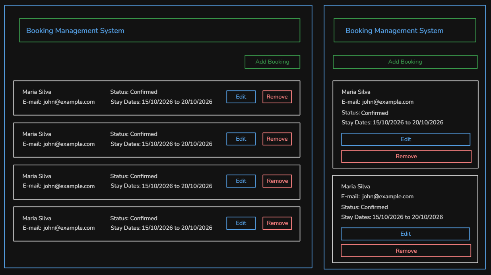
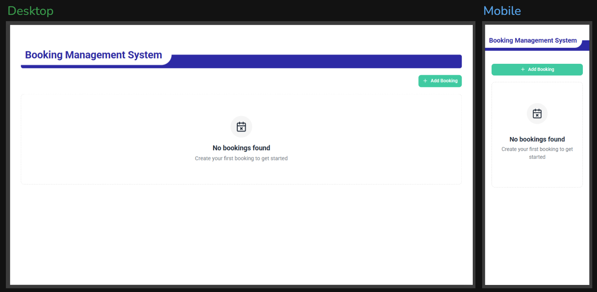
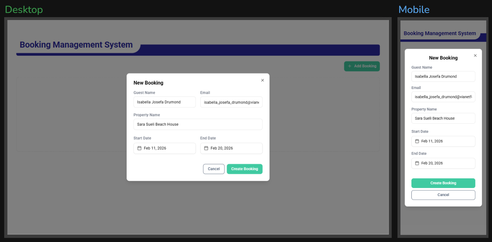
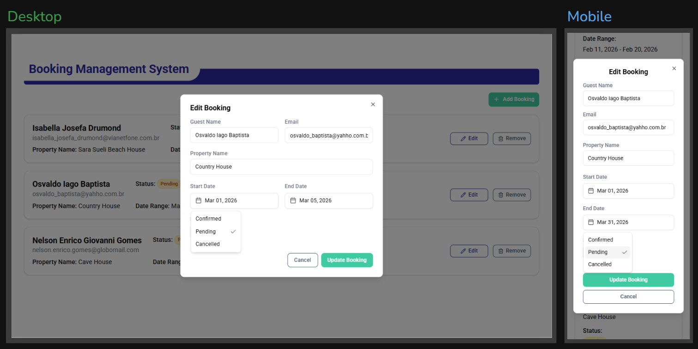
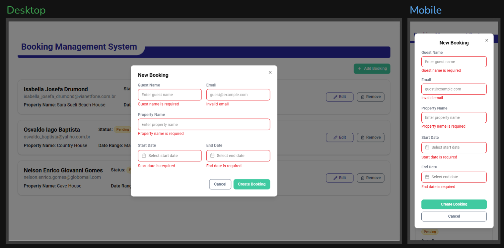
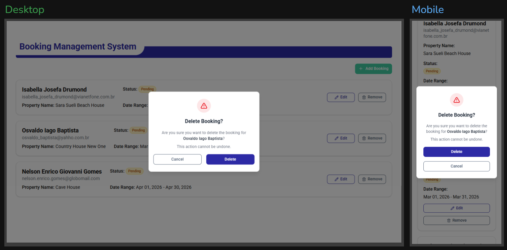
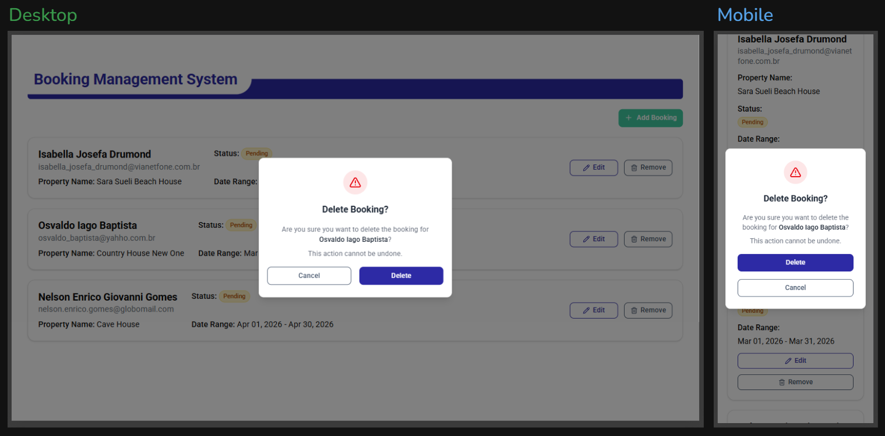

<h1 align="center">Booking Hub - Property Reservation Manager</h1>

<p align="center">
  
  
  
  
  
</p>

<div align="center">

 &nbsp;
 &nbsp;
 &nbsp;

</div>

<br>

<h3 align="center">Application Preview</h3>


<br>

## 💻 Project

Application developed as part of a **React technical test** to demonstrate modern frontend development skills.

The challenge was to create a property booking management application, implementing full CRUD operations, global state management, form validations, and responsive design.

### ✨ Implemented Features

- ✅ **Full CRUD** - Create, read, update, and delete bookings
- ✅ **Global State** - Management with Context API
- ✅ **Form Validation** - Zod + React Hook Form
- ✅ **Overlap Prevention** - Logic to prevent double bookings
- ✅ **Responsive Design** - Adaptive layout for Desktop and Mobile
- ✅ **Visual Feedback** - Toast notifications for user actions

<br>

## 🧪 Technologies

This project was developed with the following technologies:

- [React 19](https://reactjs.org)
- [TypeScript](https://www.typescriptlang.org/)
- [Vite](https://vitejs.dev/)
- [TailwindCSS](https://tailwindcss.com/)
- [Radix UI](https://www.radix-ui.com/)
- [React Hook Form](https://react-hook-form.com/)
- [Zod](https://zod.dev/)
- [date-fns](https://date-fns.org/)
- [Sonner](https://sonner.emilkowal.ski/)

<br>

## 🎨 Planning & Approach

To tackle this challenge, I split the development into **2 main parts**:

### 1️⃣ Layout (Design & UI)

First, I focused on the visual structure of the application, creating wireframes to define the layout of elements for both desktop and mobile, as well as establishing the color palette and typography.

### 2️⃣ Features (Functionality)

Once the visual foundation was defined, I moved on to implementing CRUD features, validations, and state management.

### 📐 Wireframes

<details>
<summary>Click to see the planning wireframes</summary>

<br>

#### Layout Desktop & Mobile



#### Color Palette & Typography


</details>

### 🔀 Development Strategy

- **Feature branches** - Split into `feature/layout` and `feature/booking-management`
- **Incremental commits** - Small focused commits per feature
- **Component-first** - Building reusable components with shadcn/ui

<br>

## 📸 Screenshots

<details>
<summary>View all screenshots</summary>

<br>

### Empty State



### Create Booking



### Edit Booking



### Form Validation



### Overlap Error



### Delete Confirmation



</details>

<br>

## 🚀 Getting Started

Clone the project and navigate to the folder.

```bash
$ git clone https://github.com/Jonathan-Rios/booking-hub.git

$ cd booking-hub
```

To run it, follow the steps below:

```bash
# Install dependencies
$ pnpm install

# Start the project
$ pnpm dev
```

The app will be available in your browser at http://localhost:5173

<br>

## 📝 License

This project is under the MIT license. See the [LICENSE](./LICENSE) file for more details.

<br />

---

<br />

<a href="https://github.com/Jonathan-Rios">
 
 <br />
 <sub><b>Jonathan Rios Sousa</b></sub></a>

💠 NeverStopLearning 💠

[](https://www.linkedin.com/in/jonathan-rios-sousa-19b3431b6/)
[](mailto:jonathan.riosousa@gmail.com)
